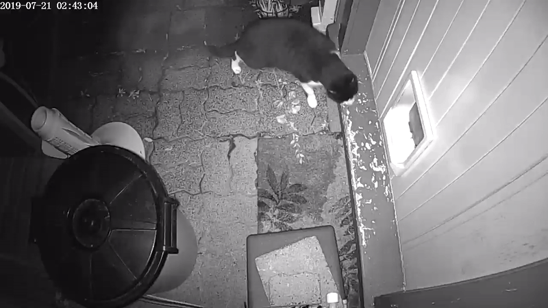

# Bad Cat Detector

This is a set of utilities for training and running a Keras classifier that can determine whether an undesirable cat is trying to enter your home, and convince it to go elsewhere.

## Why?

The neighbors cat kept stealing our cat food. Many low-tech solutions for keeping their cat out were explored. Eventually high-tech solutions were all that remained.

## Does it Work?

Yes it does:

Their cat only visited twice before deciding our food just wasn't worth the effort. Our own cat is able to come and go freely without being squirted.

## What's in the Repository?

- `TrainMobileNetClassifier` and `TrainHistogramClassifier` are Jupyter notebooks which can be used to train a Keras model and export it as a Tensorflow Lite model to be used with the classifier.
- `src.utils` contains some shared OpenCV based image processing functions.
- `src.training_generators.generate_images` can be used to extract training images from a directory of videos (organised by category) and save them to an output directory.
- `src.training_generators.generate_histograms` can be used to extract training histograms from a directory of videos (organised by category) and save them to an output directory as a pandas dataframe.
- `src.test_video` can be used to run the classifier against a specific video for testing.
- `src.detector` is a multi-threaded process that captures frames from the camera, classifies them, and stores video of detected motion.
